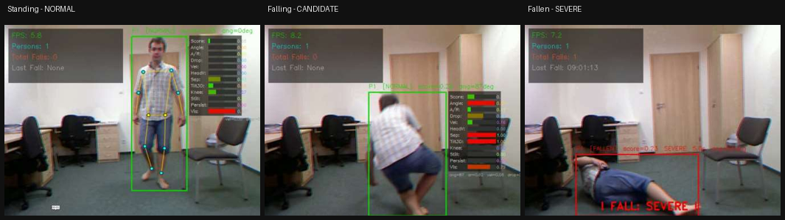
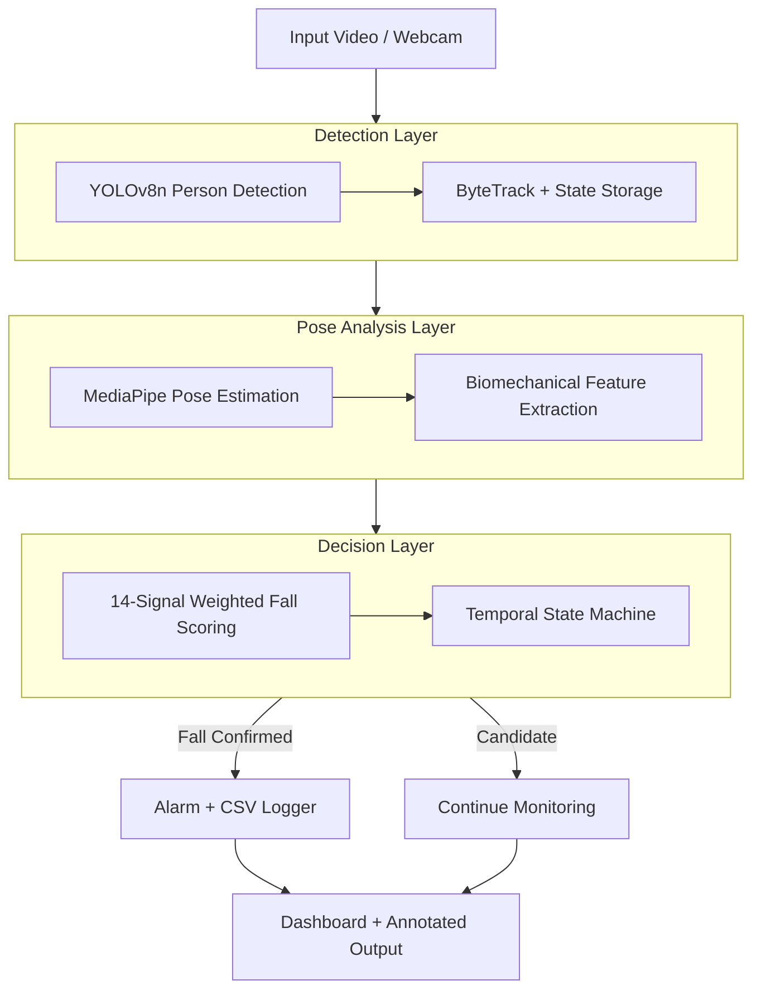

# 🧍‍♂️➡️🛌 Real-Time Fall Detection System

**YOLOv8 + MediaPipe Pose Estimation with Severity Classification & Smart Alerting**


A real-time, CPU-only fall detection system for elderly/independent-living monitoring. It watches a
single RGB camera feed, tracks every person in frame, scores 20 biomechanical signals per person
per frame, and confirms falls through a temporal state machine — then classifies severity, sounds a
two-phase alarm, and automatically logs the event with a timestamped screenshot.

Built as a Diploma Final Year Project at **Ghani Khan Choudhury Institute of Engineering & Technology**
by Nabyendu Adhikary, Sagar Halder, and Prasenjit Mandal, under the guidance of Dr. Ajit Kumar Singh Yadav.

<p align="center">
  
</p>

---

## ✨ Key Features

- **Multi-person tracking** — YOLOv8 Nano + ByteTrack, with per-person persistent state and
  track-inheritance to survive brief detection dropouts.
- **33-point pose estimation** — MediaPipe Pose Landmarker, including metric 3D world landmarks.
- **14-signal weighted fall scoring** — torso angle, hip/head velocity, height drop, aspect ratio,
  knee collapse, shoulder–hip separation, bilateral asymmetry, post-impact stillness, 3D torso tilt,
  and more, combined into one continuous fall-probability score.
- **Temporal confirmation state machine** — an 8-frame confirmation window plus a dual-path reset
  (frame-count and geometry-based) suppresses transient false positives from bending, sitting, or
  occlusion.
- **3-level severity classification** — MILD / MODERATE / SEVERE, monotonically non-decreasing per
  event, so alerts never "downgrade" mid-fall.
- **Two-phase audio alarm** — a soft double-beep on confirmation, escalating to a continuous
  high-pitch alarm if the person is still down after 5 seconds (mirrors the clinical "long lie" risk).
- **Automatic incident logging** — every confirmed fall is written to a CSV with a timestamped
  screenshot, no manual effort required.
- **Live HUD dashboard** — on-screen FPS, person count, fall history, per-person factor panel, and
  color-coded alerts.
- **Runs on a CPU** — no GPU, no cloud inference, 25–30 FPS on a standard laptop.

---

## 🏗️ Architecture



<p align="center">
  
</p>

| Stage | Module | Responsibility |
|---|---|---|
| Detection & Tracking | `yolo_detector.py`, `person_tracker.py` | Find people, assign stable IDs, keep per-person state |
| Pose Estimation | `pose_estimator.py` | 33-point 2D + 3D world landmarks per person crop |
| Feature Extraction | `feature_extractor.py` | 20 biomechanical signals per person per frame |
| Scoring | `weighted_scoring.py` | Weighted fall score + severity score |
| State Machine | `temporal_state_machine.py` | Confirms / resets fall state over time |
| Alerts | `alarm_system.py` | Two-phase audio escalation |
| Logging | `fall_logger.py` | CSV log + screenshot on confirmed fall |
| Visualization | `dashboard.py` | HUD overlay, skeleton, factor panel, fall banner |
| Orchestration | `fall_detector.py`, `main.py` | Wires everything together, CLI entrypoint |

---

## 📊 Results

Evaluated on the **UR Fall Detection Dataset (URFD)** — 30 fall clips + 30 Activities of Daily
Living (ADL) clips, decision made at the event/CSV-log level.

| Metric | Value |
|---|---|
| Sensitivity (Recall) | **93.33%** |
| Precision | 80.00% |
| F1 Score | 86.15% |
| Accuracy | 85.00% |
| Specificity | 76.67% |
| False Alarm Rate | 23.33% |
| Throughput | 25–30 FPS (CPU only) |

**Confusion matrix**

| | Predicted: FALL | Predicted: NO FALL |
|---|---|---|
| **Actual: FALL** | TP = 28 | FN = 2 |
| **Actual: NO FALL** | FP = 7 | TN = 23 |

The system prioritizes sensitivity over precision by design — in a safety-critical setting, a missed
fall is far more costly than a false alarm. Most false positives came from ADL activities that share
geometry with falls (sitting on the floor, crawling, lying on a low bed) — see [`docs/project_report.pdf`](docs/project_report.pdf)
§4.4 for a full discussion.

---

## 📦 Project Structure

```
fall-detection-system/
├── main.py                    # CLI entrypoint (VS Code / terminal)
├── fall_detector.py           # End-to-end pipeline orchestrator
├── yolo_detector.py           # YOLOv8 + ByteTrack person detection
├── person_tracker.py          # Per-person state store, track inheritance, NMS
├── pose_estimator.py          # MediaPipe Pose Landmarker wrapper
├── feature_extractor.py       # 20 biomechanical signal computations
├── weighted_scoring.py        # 14-signal weighted fall score + severity
├── temporal_state_machine.py  # Confirm/reset temporal logic
├── alarm_system.py            # Two-phase audio alarm
├── fall_logger.py             # CSV + screenshot logging
├── dashboard.py                # HUD overlay & visualization
├── requirements.txt
├── yolov8n.pt                  # YOLOv8 Nano weights (COCO-pretrained)
├── pose_landmarker.task        # MediaPipe Pose Landmarker model
├── assets/                     # README images
├── docs/
│   └── project_report.pdf      # Full diploma project report
└── fall_logs/ · fall_events.csv   # created at runtime (git-ignored)
```

---

## 🚀 Getting Started

### 1. Clone and set up an environment

```bash
git clone https://github.com/Nabyendu-the-noob/real-time-fall-detection.git
cd real-time-fall-detection

python -m venv venv
source venv/bin/activate      # Windows: venv\Scripts\activate

pip install -r requirements.txt
```

### 2. Models

`yolov8n.pt` and `pose_landmarker.task` are included in the repo (≈6 MB each). If you'd rather fetch
them fresh:

```bash
# YOLOv8n — auto-downloads on first run via ultralytics, or:
python -c "from ultralytics import YOLO; YOLO('yolov8n.pt')"

# MediaPipe Pose Landmarker (Lite/Full/Heavy variants available)
https://ai.google.dev/edge/mediapipe/solutions/vision/pose_landmarker
```

### 3. Run

```bash
# Pre-recorded video
python main.py --source path/to/video.mp4

# Webcam
python main.py --source 0

# Headless (server / no display), custom output path
python main.py --source video.mp4 --no-display --output result.mp4
```

Press **`q`** in the preview window to stop early. Output video, `fall_events.csv`, and
`fall_logs/*.png` screenshots are written alongside the script.

---

## 🔮 Limitations & Roadmap

Current limitations (see report §4.4.5):
- Evaluated on a single fixed indoor camera angle; untested on outdoor/fisheye setups.
- False alarms mainly from ADL activities that geometrically resemble falls (crawling, slow floor-sitting).
- Multi-person scenarios with heavy bounding-box overlap are not fully evaluated.

Planned next steps:
- [ ] Velocity-spike gating + sustained-movement timeout to cut ADL false alarms
- [ ] SMS / email / push alerts for remote caregivers
- [ ] RTSP stream support for existing CCTV integration
- [ ] Multi-camera fusion to remove blind spots
- [ ] Learned (data-driven) severity model to replace the rule-based scorer

---

## 📄 Report & Citation

The full methodology, related-work review, and evaluation are documented in
[`docs/project_report.pdf`](docs/project_report.pdf).

```
Adhikary, N., Halder, S., Mandal, P. (2026).
Fall Detection System Using YOLOv8 + MediaPipe Pose Estimation with
Severity Classification & Smart Alerting. Diploma Final Year Project,
Ghani Khan Choudhury Institute of Engineering & Technology.
```

## 🛠️ Tech Stack

Python · OpenCV · [Ultralytics YOLOv8](https://github.com/ultralytics/ultralytics) · ByteTrack ·
[MediaPipe Pose Landmarker](https://ai.google.dev/edge/mediapipe/solutions/vision/pose_landmarker) · NumPy · pygame

## 📜 License

Released under the [MIT License](LICENSE).
